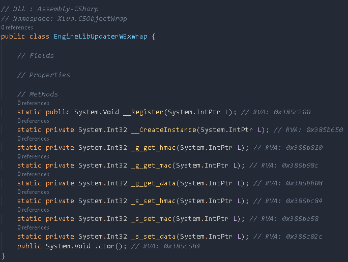
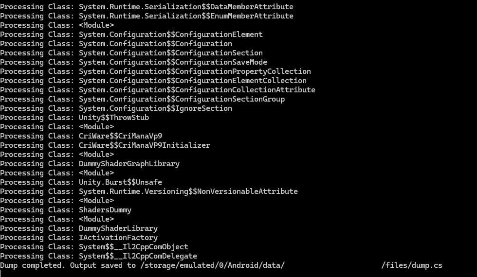

# Frida Manager

## About

-  simple tool to manage plugins 
- added a frida dumper feature

## Build
- npm run build 
- npx frida-compile agent/index.ts -o _agent.js

## How to run
- frida -Uf com.package.name -l _agent.js

## How to dump
- type rpx.exports.start();

## Screenshots

## Tools needed

needs my modified version of [Il2cpp-frida-bridge](https://github.com/yoncodes/frida-il2cpp-bridge) to work

## Notes

Part of another Project I'm working on for a friend.